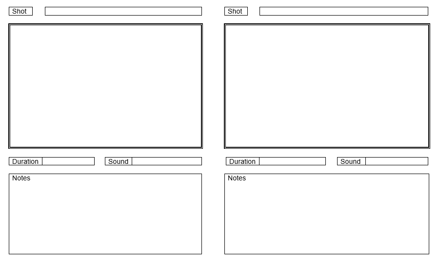

# Animation Fundamentals

[https://www.sqa.org.uk/files/nu/F1KB11.pdf](https://www.sqa.org.uk/files/nu/F1KB11.pdf)

**Evidence Requirements**

1. Produce a Plan based on the Brief, including;

* Plan
* Schedule
* [Storyboard](https://tutor.neocities.org/Storyboard.doc)
* Sketches
* Cleaned-up drawings

2. Produce an Animation based on a Brief, including;

* Key frames
* In between's
* Motion Tween

3. Present your film to the class

* Video File
* Take Questions

## Brief

You have been approached by the UK Government to produce an advert promoting the benefits of healthy eating.

You have been asked to produce a 30 second two-dimensional animated sequence created at 1280\*720 resolution. It must be submitted as a .mp4 file under 100mb in size.

## Techniques

**Squash & Stretch**

Objects expanding and contracting, often unrealistically to emphasize a movement.

**Anticipation**

Before an Object moves, it will signal which direction it is about to move, with a subtle opposite movement. 

**Follow Through**

When an object comes to rest we observe 'follow through', which is essentially the opposite of anticipation

**Staging**

It should be clear where on the screen the audience should be looking - there should be nothing else to distract them happening elsewhere

**Overlapping Action**

Momentum being carried through in other parts - eg. hair and clothes

**Ease In & Out**

Objects take time to accelerate up to speed, and, to decelerate to a stop

#### Arcs

Smooth Curves that features follow during playback

**Secondary Action**

Gestures that support the main action to add more dimension - often conveying an emotion

**Timing**

Great drawings do not equal great animation. It is important to experiment with timing speeds and dropping frames all together

#### Exaggeration

Even realistic or mechanical motion has exaggeration. In cartoon animation we see actions overshoot to the extreme

**Appeal**

Appeal is something we like about a character

## Pose to Pose

In pose to pose Animation we plan ahead - deciding on the most important poses that the character will assume - we then fill in the smaller details afterwards

## Straight Ahead

In straight ahead animation we just keep drawing based on the last image - it can significantly harder to preserve volume using this technique - however, it is easy to create a sense of fluidity

## Frame Rates

12 Frames per second - good for beginners - animating on two's

24 Frames per second - Cinema and TV - animating in one's

15 / 30 frames per second - The NTSC standard equivalent of the above

60 frames per second - Video Games Standard

## Timing

The closer together frames are the slower the the animation will be

The further apart the frames are the faster the motion will be

We can hold onto frames for a little longer to make them pop. 

Often, more less is more

## Storyboards

Storyboards are a way to plan out visual information for film

Each panel will show a significant action - along with notes on sound, camera movements and descriptions

It is much more important for a Storyboard to convey an idea than for it to have a finished look

Large arrows can be used to indicate direction of movement

Here is a Blank Template for you to use

Here is an example from an animated Series

## Motion Tweening

Motion Tweening is short for 'In Betweening' - We can ask a computer to create the frames between two poses for us. For motion graphics and small movements this is great. For characters however -  it tends to create awkward movements

## Adobe Animate CC \( Flash \)

For your project you will have access to Adobe Animate CC which is used in professional Animation studios. Other professional software includes Toon Boom Harmony, TVPaint & Toonz. Some studios produce their 2D animations entirely in 3D Software.

Keyboard Shortcuts

F5 - Stretch frame

F6 - Duplicate Frame

F7-  New Blank Frame

F8 - New Movie

Enter - Play

In order to create a motion tween in animate, we select an object - press F8 to create a new object - press F5 to extend our frame - right-click on the strip and select "Create Motion Tween" - and then click along the strip and then move the object.

## Software

There are lot's of free animation tools available - they can be very complicated - so these are my recommendations to focus on the actual art of animation

Working at a low resolution actually ensures strong readability of motion without getting bogged down in the finer details





