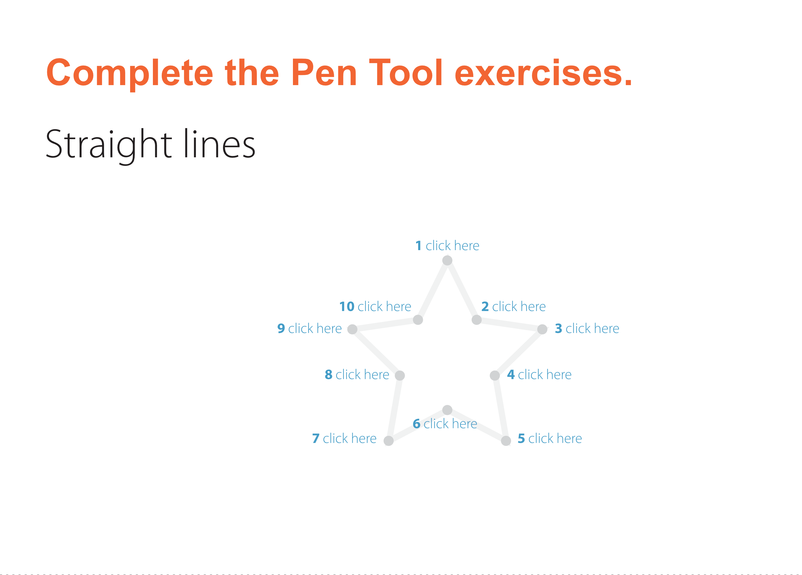
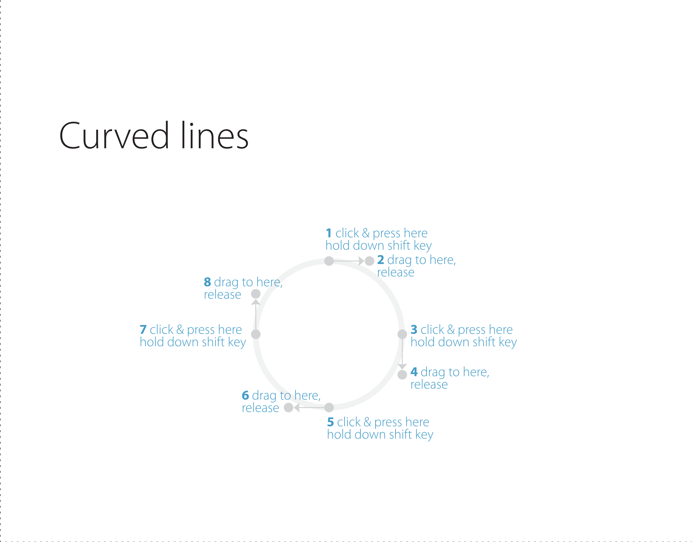
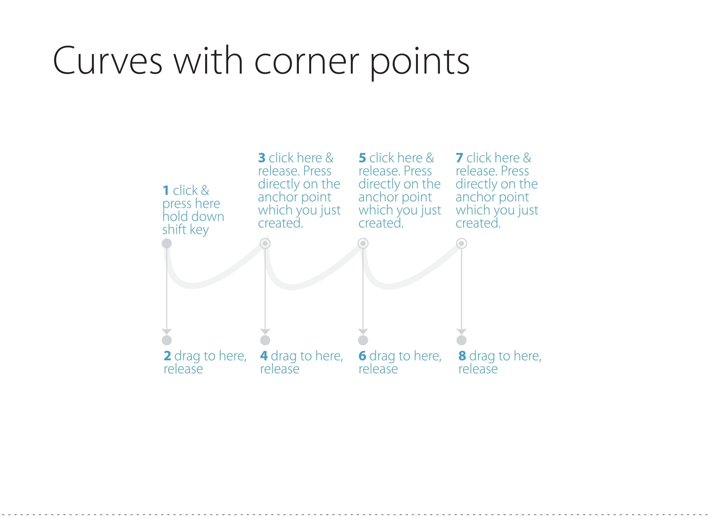
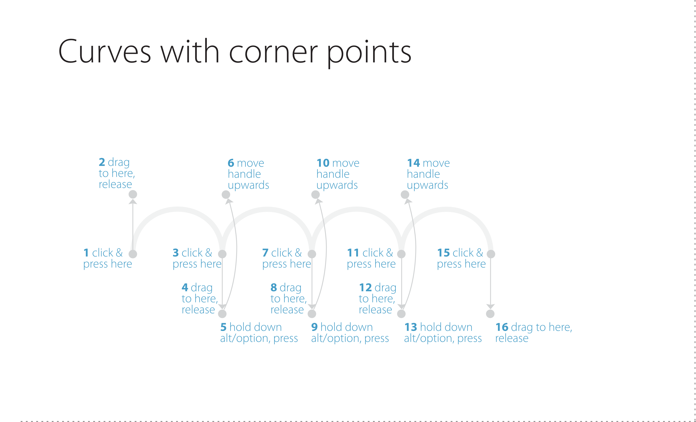
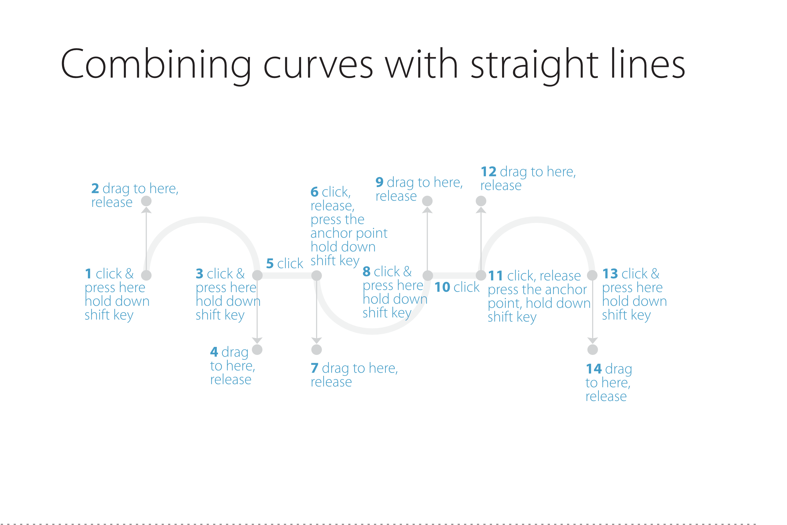

# NC Fashion & Textiles

[https://www.sqa.org.uk/files/nq/FP5012.pdf](https://www.sqa.org.uk/files/nq/FP5012.pdf)

## Outcome 1

Use basic functions of fashion illustration software. 

* \(a\) Use basic functions of fashion illustration software correctly. 
* \(b\) Save files in an appropriate format and location. 
* \(c\) Present drawings in an appropriate format. 

## Outcome 2 

Generate flat drawings of garments using fashion illustration software. 

* \(a\) Use fashion illustration software effectively to generate flat drawings for simple garments. 
* \(b\) Use the tools of fashion illustration software effectively to add style details to simple garments. 

## Outcome 3

Render garment drawings using fashion illustration software.

* \(a\) Use fashion illustration software effectively to render given flat drawings using different techniques. 
* \(b\) Use fashion illustration software effectively to produce 3 colour illustrations.

## Pen Excercises

## Collections

We can use Google Collections [https://www.google.com/collections](https://www.google.com/collections) to save images that inspire us - we can then use these as a mood board

