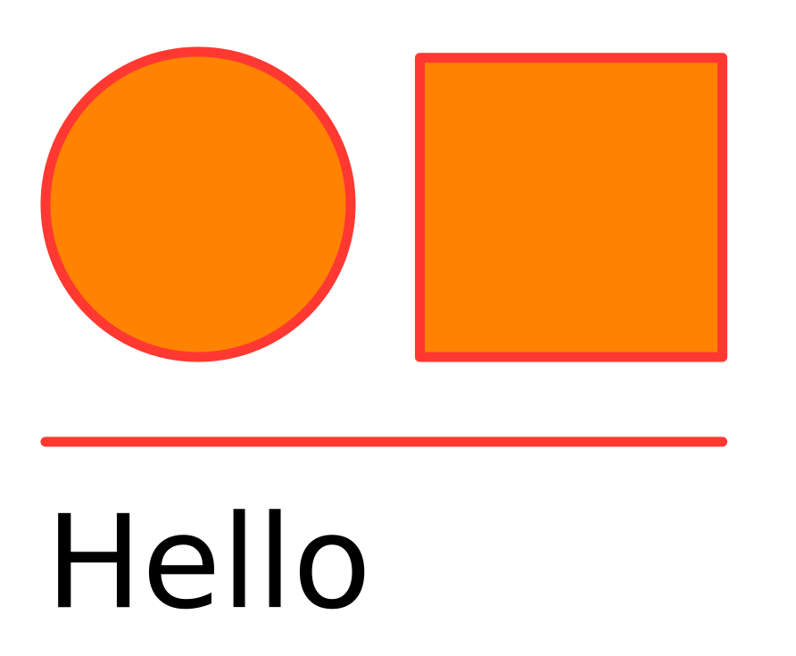
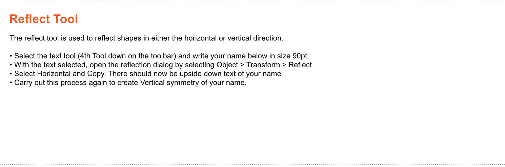
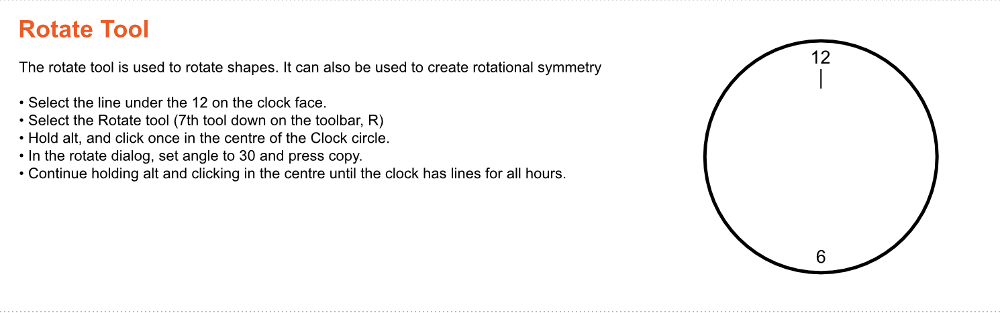
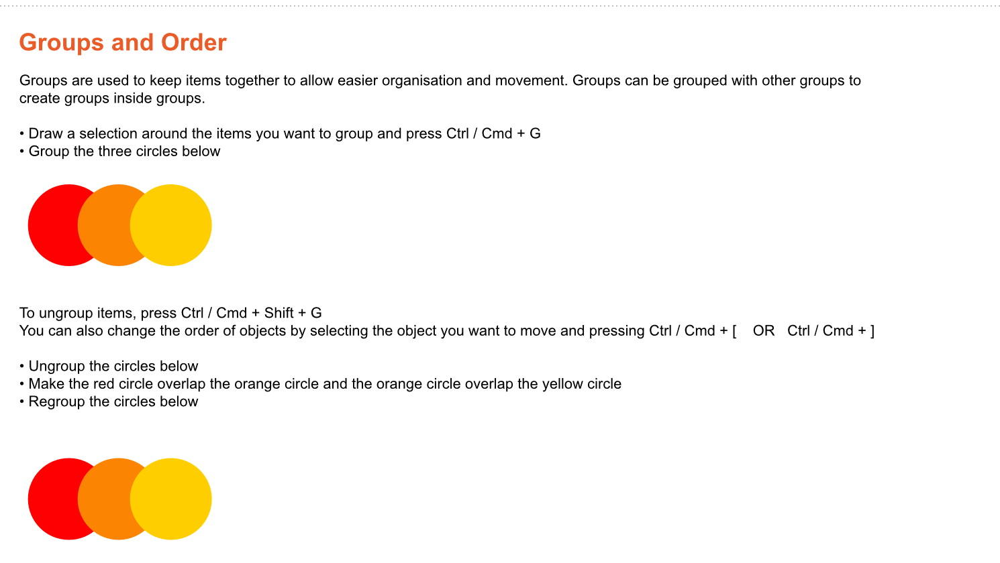

# Week 2

## Bitmap vs Vector

## Resolution

Resolution is the number of pixels recorded in the image.  DPI \( Dots per inch \) defines the image detail in print PPI \( Pixel per inch \) define the image detail on a screen


## Colour Depth

Colour Depth describes the number of available colours in an image. Colour banding is a result of a low colour depth.

Smart use of dithering can be used to improve the perception of colour.


## Data

### **Bitmap**

Raster Image formats record data in a grid. A 1-bit bitmap can be visualized as below.  After brief header information \( which will describe how wide and how high the image is \) this image could be written as;


```text
0001111000000100100000010010001111111111111111111101000000101110000111101000010110100001011010000101
```

### **Advantages**

* can show photographs
* almost no processing powered required

Disadvantages

* Not scalable

### **Vector** 

Vector Image formats record co-ordinates, shapes, fill colours and curves. Like a graph calculator

If we open a calculator here [https://www.desmos.com/calculator](https://www.desmos.com/calculator) and input x²+y²=6 we can draw a circle :\)



We can download this file and open it in a text readed to see how the information is recorded -this is what you would see

```text
<svg width="100%" height="100%" viewBox="0 0 892 735" version="1.1" xmlns="http://www.w3.org/2000/svg" xmlns:xlink="http://www.w3.org/1999/xlink" xml:space="preserve" xmlns:serif="http://www.serif.com/" style="fill-rule:evenodd;clip-rule:evenodd;stroke-linecap:round;stroke-linejoin:round;stroke-miterlimit:1.5;">
<rect id="Artboard1" x="0" y="0" width="892" height="735" style="fill:none;"/>
<g id="Artboard11" serif:id="Artboard1"><circle cx="222" cy="229" r="171" style="fill:#ff8200;stroke:#ff3932;stroke-width:11.11px;"/>
<rect x="470.5" y="64.809" width="339" height="335.191" style="fill:#ff8200;stroke:#ff3932;stroke-width:11.11px;"/><path d="M51,495l758.5,0" style="fill:none;stroke:#ff3932;stroke-width:11.11px;"/>
<text x="51px" y="680.148px" style="font-family:'ArialMT', 'Arial', sans-serif;font-size:144px;">Hello</text></g></svg>
```

It is possible to write images by hand in text like this, we can make changes to the size of the circles, the font name, the text etc.

Below is an example of a hand coded image, by clicking and moving around we can see some of the advantages and disadvantages of this technique

[https://diana-adrianne.com/purecss-lace/](https://diana-adrianne.com/purecss-lace/)

Advantages

* small file size
* infintley scalable
* easily editable

Disadvatages

* non intuitive
* Takes more processing power to render
* Can't show photographs
* easily editable

## File Management

Save all of your completed excercise in a new folder called 'Digital Fashion Illustration' on OneDrive

You must use a meaningfull, descriptive name that will give context to the file when you look back at it after time has passed

.ai files are Adobe Ilustrator files that can be edited, file types .jpg .png will be easily readable but will not be editiable

## Tool Excercises









## Excercise

Create a new document using the below settings


Now create a self portrait as best you can

Try using

* pen tool
* pencil tool
* shapes
* gradients
* booleans

