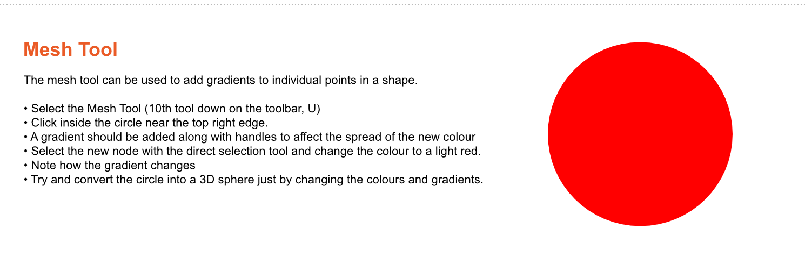

# Week 2

## File Management

Save all of your completed excercise in a new folder called 'Digital Fashion Illustration' on OneDrive

You must use a meaningfull, descriptive name that will give context to the file when you look back at it after time has passed

.ai files are Adobe Ilustrator files that can be edited, file types .jpg .png will be easily readable but will not be editiable

## Excercises

