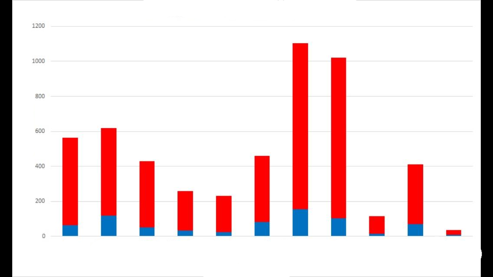

# Week 1

## Data and Information

Make a note of your answers in a new Word Document, which you will submit save into your OneDrive Folder


If you get stuck, hints can be found at the bottom of the page


### Task 1

Use the internet to find the hidden message in the text below - Make a note of your  answer

```text
コンピューティングへようこそ
```

### Task 2

Use the internet to find the hidden message - Make a note of your  answer

```text
بلیوں کتے سے بہتر ہیں
```

### Task 3

Use the internet to find the hidden message - Make a note of your  answer

```text
Mae'r coleg hwn yn yr Alban
```

### Task 4

Use the internet to find the hidden message - Make a note of your  answer

```text
01001100 01100101 01110111 01101001 01110011 00100000 01101100 01101001 01101011 01100101 00100000 01110100 01101111 00100000 01110000 01101100 01100001 01111001 00100000 01100011 01101111 01101101 01110000 01110101 01110100 01100101 01110010 00100000 01100111 01100001 01101101 01100101 01110011
```


[https://www.rapidtables.com/convert/number/binary-to-ascii.html](https://www.rapidtables.com/convert/number/binary-to-ascii.html)


### Task 5

Look at the graph below, what does it tell you? - Make a note of your  answer



### Task 6

Use the internet to find the hidden message - Make a note of your  answer

```text
44 6f 6f 6d 20 45 74 65 72 6e 61 6c 20 77 61 73 20 61 20 67 72 65 61 74 20 67 61 6d 65
```


[https://www.rapidtables.com/convert/number/hex-to-ascii.html](https://www.rapidtables.com/convert/number/hex-to-ascii.html)


### Task 7

Look at the graph below, which Nintendo Console sold the most units?


Data vs Information


Blank Graph

Then Fill


Binary info with no context


Data is numbers

Information is human readable and has meaning

Hints



Try using Google Translate



[https://www.rapidtables.com/convert/number/binary-to-ascii.html](https://www.rapidtables.com/convert/number/binary-to-ascii.html) Binary to text converter



[https://www.rapidtables.com/convert/number/hex-to-ascii.html](https://www.rapidtables.com/convert/number/hex-to-ascii.html) Hex to Text converter


