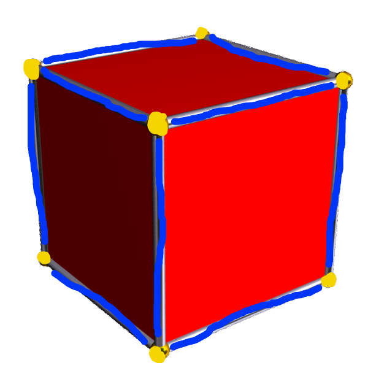

# Open Learning Resource

Learning the basics of 3D modelling is a great use of open education resources – the software we will be looking at, Blender 3D, is itself free and open-source.

The Blender Manual can be found here [Blender 2.91 Reference Manual — Blender Manual](https://docs.blender.org/manual/en/latest/)

As an example of what can be created in Blender, they release films and production assets under creative commons.

Here is an example of one of their short films [Big Buck Bunny Content Gallery - Blender Cloud](https://cloud.blender.org/films/big-buck-bunny/gallery?asset=263)

We will look at information available on Wikipedia to help us understand want is meant by the term, 3D Model

This Cube Illustrates three basic concepts of 3d Modelling, Vertices, Edges and Faces.

The license used allows for remix so I shall remix it to label the image

I have now labelled the cube and created my own derivative work which is also available under the CC BY-SA 3.0 licence, but the original attribution must remain.

* The yellow points are vertex or vertices
* The blue lines are edges
* The red planes are faces

Textures are image files that are projected onto our 3d models, a great resource for these is here [CC0 Textures - Free Public Domain PBR Materials](https://cc0textures.com/)

Please find and download a suitable wood texture.

This concludes our first lesson.

This resource is made available by Lewis Sturrock under Attribution 4.0 International \(CC BY 4.0\) [https://creativecommons.org/licenses/by/4.0/](https://creativecommons.org/licenses/by/4.0/)

